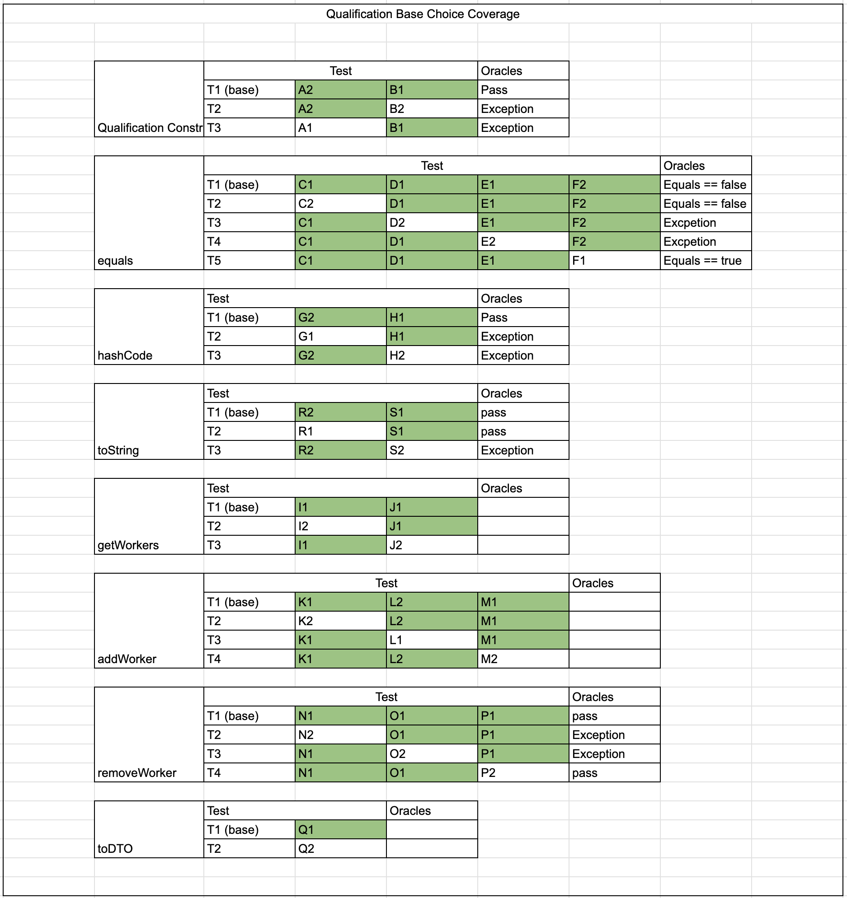
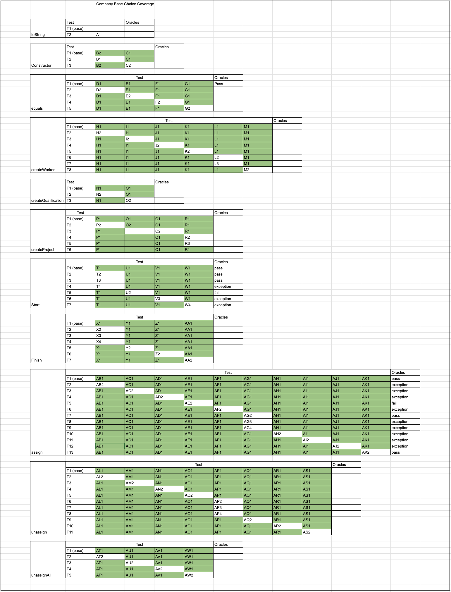
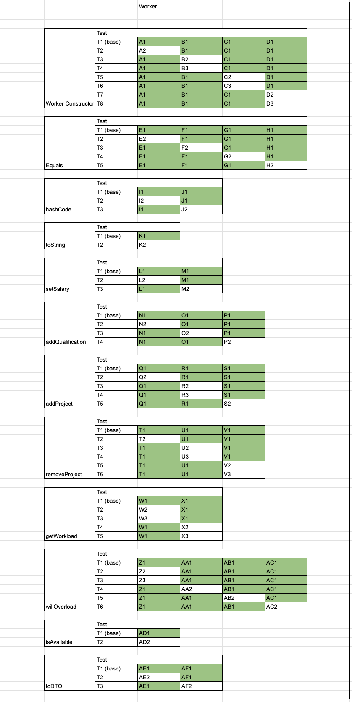
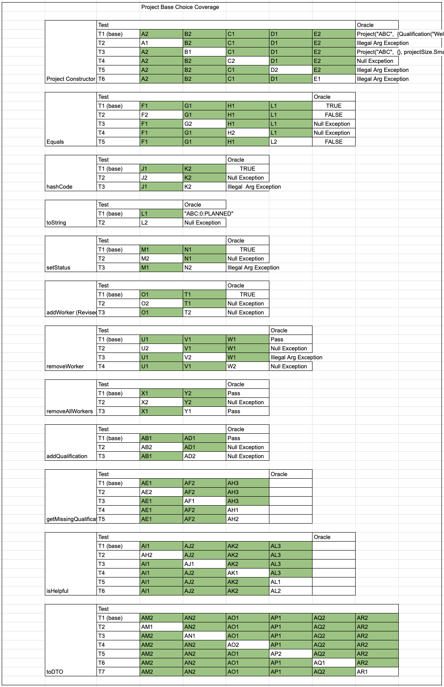

# P16 ISP Tabels

# Qualification

| Method                        | Variables                    | Characteristic | Partition                            | Value                                                                                                  |
| ----------------------------- | ---------------------------- | -------------- | ------------------------------------ | ------------------------------------------------------------------------------------------------------ |
|                               |                              |                |                                      |                                                                                                        |
| Qualification Constructor     | description                  | A) size        | A1) size == 0                        | ""                                                                                                     |
|                               |                              |                | ==A2) size > 0 (base)==              | "ABC"                                                                                                  |
|                               |                              | B) Null?       | ==B1) Not Null (base)==              | "ABC"                                                                                                  |
|                               |                              |                | B2) Null                             | Null                                                                                                   |
| equals                        | Object o                     | C) Type        | ==C1) Type == Qualification (base)== | Qualification("ABC")                                                                                   |
|                               |                              |                | C2) type != Qualification            | Company("ABC")                                                                                         |
|                               |                              | D) Null?       | ==D1) Not Null (base)==              | Qualification("ABC")                                                                                   |
|                               |                              |                | D2) Null                             | Null                                                                                                   |
|                               | Qualification curr           | E) Null?       | ==E1) Not Null (base)==              | Qualification("BCD")                                                                                   |
|                               |                              |                | E2) Null                             | Null                                                                                                   |
|                               | Object o, Qualification curr | F) Match?      | F1) Do match                         | o == Qualification("ABC") curr == Qualification("ABC")                                                 |
|                               |                              |                | ==F2) Don't match (base)==           | o == Qualification("ABC") curr == Qualification("DEF")                                                 |
| hashCode                      | description                  | G) size        | G1) size == 0                        | ""                                                                                                     |
|                               |                              |                | ==G2) size > 0 (base)==              | "ABC"                                                                                                  |
|                               |                              | H) Null?       | ==H1) Not Null (base)==              | "ABC"                                                                                                  |
|                               |                              |                | H2) Null                             | Null                                                                                                   |
| getWorkers                    | Qualification                | I) Null?       | ==I1) Not Null (base)==              | Qualification("ABC")                                                                                   |
|                               |                              |                | I2) Null                             | Null                                                                                                   |
|                               | Set<Workers>                 | J) Empty?      | ==J1) Not Empty (base)==             | {Worker("Greg", {Qualification("Welding")}, 20.00), Worker("Bob", {Qualification("Painting")}, 30.00)} |
|                               |                              |                | J2) Empty                            | {}                                                                                                     |
| addWorker                     | Qualification                | K) Null?       | ==K1) Not Null (base)==              | Qualification("ABC")                                                                                   |
|                               |                              |                | K2) Null                             | Null                                                                                                   |
|                               | Set<Workers>                 | L) Empty?      | L1) Not Empty                        | {Worker("Greg", {Qualification("Welding")}, 20.00), Worker("Bob", {Qualification("Painting")}, 30.00)} |
|                               |                              |                | ==L2) Empty (base)==                 | {}                                                                                                     |
|                               | Worker                       | M) Null?       | ==M1) Not Null (base)==              | Worker("Greg", {Qualification("Welding")}, 20.00)                                                      |
|                               |                              |                | M2) Null                             | Null                                                                                                   |
| removeWorker(w: Worker): void | Qualification                | N) Null?       | ==N1) Not ==Null                     | Qualification("ABC")                                                                                   |
|                               |                              |                | N2) Null                             | Null                                                                                                   |
|                               | Set<Workers>                 | O) Empty?      | ==O1) Not Empty (base)==             | {Worker("Greg", {Qualification("Welding")}, 20.00), Worker("Bob", {Qualification("Painting")}, 30.00)} |
|                               |                              |                | O2) Empty                            | {}                                                                                                     |
|                               | Worker                       | P) Null?       | ==P1) Not Null (base)==              | Worker("Greg", {Qualification("Welding")}, 20.00)                                                      |
|                               |                              |                | P2) Null                             | Null                                                                                                   |
| toDTO(): QualificationDTO     | Set<Workers>                 | Q) Empty?      | ==Q1) Not Empty (base)==             | {Worker("Greg", {Qualification("Welding")}, 20.00), Worker("Bob", {Qualification("Painting")}, 30.00)} |
|                               |                              |                | Q2) Empty                            | {}                                                                                                     |
| toString                      | description                  | R) size        | R1) size == 0                        | ""                                                                                                     |
|                               |                              |                | ==R2) size > 0 (base)==              | "ABC"                                                                                                  |
|                               |                              | S) Null?       | ==S1) Not Null (base)==              | "ABC"                                                                                                  |
|                               |                              |                | S2) Null                             | Null                                                                                                   |

# Company

| Method              | Variables              | Characteristic                                                | Partition                                                     | Value                                          |
| ------------------- | ---------------------- | ------------------------------------------------------------- | ------------------------------------------------------------- | ---------------------------------------------- |
| toString            | Company                | A) Null?                                                      | ==A1) Not Null (base)==                                       | toString                                       |
|                     |                        |                                                               | A2) Null                                                      |                                                |
| Constructor         | name                   | B) size                                                       | B1) size == 0                                                 | Constructor                                    |
|                     |                        |                                                               | ==B2) size > 0 (base)==                                       |                                                |
|                     |                        | C) Null?                                                      | ==C1) Not Null (base)==                                       |                                                |
|                     |                        |                                                               | C2) Null                                                      |                                                |
| equals              | Object o               | D) Type                                                       | ==D1) Type == Company (base)==                                | Company("ABC")                                 |
|                     |                        |                                                               | D2) type != Company                                           | Qualification("ABC")                           |
|                     |                        | E) Null?                                                      | ==E1) Not Null (base)==                                       | Company("ABC")                                 |
|                     |                        |                                                               | E2) Null                                                      | Null                                           |
|                     | Company curr           | F) Null?                                                      | ==F1) Not Null (base)==                                       | Company("BCD")                                 |
|                     |                        |                                                               | F2) Null                                                      | Null                                           |
|                     | Object o, Company curr | G) Match?                                                     | ==G1) Do match (base)==                                       | o == Company("ABC") curr == Company("ABC")     |
|                     |                        |                                                               | G2) Don't match                                               | o == Company("ABC") curr == Company("DEF")     |
| createWorker        | name                   | H) size                                                       | ==H1) size > 0 (base)==                                       | "ABC"                                          |
|                     |                        |                                                               | H2) size == 0                                                 | ""                                             |
|                     |                        | I) Null?                                                      | ==I1) Not Null (base)==                                       | "ABC"                                          |
|                     |                        |                                                               | I2) Null                                                      | Null                                           |
|                     | qs                     | J) Null?                                                      | ==J1) Not Null (base)==                                       | "ABC"                                          |
|                     |                        |                                                               | J2) Null                                                      | Null                                           |
|                     |                        | K) Does Qualifcation exist?                                   | ==K1) Exists (base)==                                         | [Qualification("ABC")]                         |
|                     |                        |                                                               | K2) Does not exist                                            | []                                             |
|                     | salary                 | L) Sign                                                       | ==L1) Positive (base)==                                       | salary == 5.0                                  |
|                     |                        |                                                               | L2) Negative                                                  | salary == -5.0                                 |
|                     |                        |                                                               | L3) Zero                                                      | salary == 0                                    |
| createQualification | description            | N) size                                                       | ==N1) size > 0 (base)==                                       | "ABC"                                          |
|                     |                        |                                                               | N2) size == 0                                                 | ""                                             |
|                     |                        | O) Null?                                                      | ==O1) Not Null (base)==                                       | "ABC"                                          |
|                     |                        |                                                               | O2) Null                                                      | Null                                           |
| createProject       | name                   | P) size                                                       | ==P1) size > 0 (base)==                                       | "ABC"                                          |
|                     |                        |                                                               | P2) size == 0                                                 | ""                                             |
|                     |                        | Q) Null?                                                      | ==Q1) Not Null (base)==                                       | "ABC"                                          |
|                     |                        |                                                               | Q2) Null                                                      | Null                                           |
|                     | Project size           | R) Enum size                                                  | ==R1) medium (base)==                                         | MEDIUM                                         |
|                     |                        |                                                               | R2) small                                                     | SMALL                                          |
|                     |                        |                                                               | R3) big                                                       | BIG                                            |
|                     |                        |                                                               | R4) Null                                                      | Null                                           |
| start               | Project p              | T) enum status                                                | ==T1) Active (base)==                                         | ACTIVE                                         |
|                     |                        |                                                               | T2) Suspended                                                 | SUSPENDED                                      |
|                     |                        |                                                               | T3) Planned                                                   | PLANNED                                        |
|                     |                        |                                                               | T4) Finished                                                  | FINISHED                                       |
|                     |                        | U) Qualification requirements                                 | ==U1) Satisfied (base)==                                      | p.getMisssingQualifications() == []            |
|                     |                        |                                                               | U2) Not Satisfied                                             | p.getMisssingQualifications() == ["ABC"]       |
|                     |                        | V) Null?                                                      | ==V1) Not Null (base)==                                       | Project("BCD",Qualification("ABC",SMALL)       |
|                     |                        |                                                               | V2) Null                                                      | Null                                           |
|                     | Company curr           | W) Null?                                                      | ==W1) Not Null (base)==                                       | Company("BCD")                                 |
|                     |                        |                                                               | W2) Null                                                      | Null                                           |
| finish              | Project p              | X) enum status                                                | ==X1) Active (base)==                                         | ACTIVE                                         |
|                     |                        |                                                               | X2) Suspended                                                 | SUSPENDED                                      |
|                     |                        |                                                               | X3) Planned                                                   | PLANNED                                        |
|                     |                        |                                                               | X4) Finished                                                  | FINISHED                                       |
|                     |                        | Y) Amount of Workers                                          | ==Y1) Greater than 0 (base)==                                 | p.getWorkers == 5                              |
|                     |                        |                                                               | Y2) Zero                                                      | p.getWorkers == 0                              |
|                     |                        | Z) Null?                                                      | ==Z1) Not Null (base)==                                       | Project("BCD",Qualification("ABC",SMALL)       |
|                     |                        |                                                               | Z2) Null                                                      | Null                                           |
|                     | Company curr           | AA) Null?                                                     | ==AA1) Not Null (base)==                                      | Company("BCD")                                 |
|                     |                        |                                                               | AA2) Null                                                     | Null                                           |
| assign              | Worker w               | AB) Availability                                              | ==AB1) Is available (base)==                                  | w.isAvailable() == true                        |
|                     |                        |                                                               | AB2) Is not available                                         | w.isAvailable() == false                       |
|                     |                        | AC) Already assigned?                                         | ==AC1) Is not assigned (base)==                               | Project p is not in w.getProjects()            |
|                     |                        |                                                               | AC2) Is assigned                                              | Project p is in w.getProjects()                |
|                     |                        | AD) Become overloaded?                                        | ==AD1) Will not become overloaded (base)==                    | w.willOverload(p) == false                     |
|                     |                        |                                                               | AD2) Will become overloaded                                   | w.willOverload(p) == true                      |
|                     |                        | AE) Available after assigning                                 | ==AE1) Is still available (base)==                            | w.isAvailable() == true after assigning        |
|                     |                        |                                                               | AE2) Is not still available                                   | w.isAvailable() == false after assigning       |
|                     |                        | AF) Null?                                                     | ==AF1) Not Null (base)==                                      | Worker("BCD",Qualification("ABC"),5.0)         |
|                     |                        |                                                               | AF2) Null                                                     | Null                                           |
|                     | Project p              | AG) enum status                                               | ==AG1) Planned (base)==                                       | PLANNED                                        |
|                     |                        |                                                               | AG2) Suspended                                                | SUSPENDED                                      |
|                     |                        |                                                               | AG3) Active                                                   | ACTIVE                                         |
|                     |                        |                                                               | AG4) Finished                                                 | FINISHED                                       |
|                     |                        | AH) Worker helpful?                                           | ==AH1) Is helpful (base)==                                    | p.isHelpful(w) == true                         |
|                     |                        |                                                               | AH2) Is not helpful                                           | p.isHelpful(w) == false                        |
|                     |                        | AI) Null?                                                     | ==AI1) Not Null (base)==                                      | Project("BCD",Qualification("ABC",SMALL)       |
|                     |                        |                                                               | AI2) Null                                                     | Null                                           |
|                     | Company curr           | AJ) Null?                                                     | ==AJ1) Not Null (base)==                                      | Company("BCD")                                 |
|                     |                        |                                                               | AJ2) Null                                                     | Null                                           |
|                     |                        | AK) Worker already assigned?                                  | ==AK1) Is not already assigned (base)==                       | w is not returned in curr.getAssignedWorkers() |
|                     |                        |                                                               | AK2) Is already assigned                                      | w is returned in curr.getAssignedWorkers()     |
| unassign            | Worker w               | AL) Number of projects after unassign                         | ==AL1) More than zero (base)==                                | w.getProjects() == [Project("abc")]            |
|                     |                        |                                                               | AL2) Zero                                                     | w.getProjects() == []                          |
|                     |                        | AM) Already assigned?                                         | ==AM1) Is not assigned (base)==                               | Project p is not in w.getProjects()            |
|                     |                        |                                                               | AM2) Is assigned                                              | Project p is in w.getProjects()                |
|                     |                        | AN) Becomes available after?                                  | ==AN1) Was available and after unassign is available (base)== | w.isAvailable() == false                       |
|                     |                        |                                                               | AN2) Was not available and still available after unassign     | w.isAvailable() == true                        |
|                     |                        | AO) Null?                                                     | ==AO1) Not Null (base)==                                      | Worker("BCD",Qualification("ABC"),5.0)         |
|                     |                        |                                                               | AO2) Null                                                     | Null                                           |
|                     | Project p              | AP) enum status                                               | ==AP1) Active (base)==                                        | ACTIVE                                         |
|                     |                        |                                                               | AP2) Suspended                                                | SUSPENDED                                      |
|                     |                        |                                                               | AP1) Planned                                                  | PLANNED                                        |
|                     |                        |                                                               | AP4) Finished                                                 | FINISHED                                       |
|                     |                        | AQ) Qualifications for active status still met after unassign | ==AQ1) Not still met (base)==                                 | Project status after == SUSPENDED              |
|                     |                        |                                                               | AQ2)   Are still met                                          | Project status after == ACTIVE                 |
|                     |                        | AR) Null?                                                     | ==AR1) Not Null (base)==                                      | Project("BCD",Qualification("ABC",SMALL)       |
|                     |                        |                                                               | AR2) Null                                                     | Null                                           |
| unassignAll         | Worker w               | AT) Number of projects after unassign                         | ==AT1) Zero (base)==                                          | w.getProjects() == []                          |
|                     |                        |                                                               | AT2) More than zero                                           | w.getProjects() == [Project("abc")]            |
|                     |                        | AU) Null?                                                     | ==AU1) Not Null (base)==                                      | Worker("BCD",Qualification("ABC"),5.0)         |
|                     |                        |                                                               | AU2) Null                                                     | Null                                           |
|                     | Company curr           | AV) Null?                                                     | ==AV1) Not Null (base)==                                      | Company("BCD")                                 |
|                     |                        |                                                               | AV2) Null                                                     | Null                                           |
|                     |                        | AW) w assigned to company?                                    | ==AW1) Is not assigned (base)==                               | w is not in curr.getAssignedWorkers()              |
|                     |                        |                                                               | AW2) Is assigned                                              | w is in curr.getAssignedWorkers()          |

# Worker

| Method           | Variables             | Characteristic              | Partition                      | Value                                           |
| ---------------- | --------------------- | --------------------------- | ------------------------------ | ----------------------------------------------- |
|                  |                       |                             |                                |                                                 |
| Constructor      | name                  | A) size                     | ==A1) size > 0 (base)==        | "ABC"                                           |
|                  |                       |                             | A2) size == 0                  | ""                                              |
|                  | qs                    | B) is Null?                 | ==B1) not null (base)==        | [Qualification("ABC")]                          |
|                  |                       |                             | B2) null                       | null                                            |
|                  |                       | C) set size                 | ==C1) set size == 1 (base)==   | {[Qualification("ABC")]}                        |
|                  |                       |                             | C2) set size > 1               | {[Qualification("ABC")],[Qualification("DEF")]} |
|                  |                       |                             | C3) set size == 0              | {}                                              |
|                  | salary                | D) value                    | ==D1) value > 0 (base)==       | 100.5                                           |
|                  |                       |                             | D2) value == 0                 | 0                                               |
|                  |                       |                             | D3) value < 0                  | -100.5                                          |
| equals           | Object o              | E)Type                      | ==E1) Type == Worker (base)==  | Worker("ABC")                                   |
|                  |                       |                             | E2) type != Worker             | Qualification("ABC")                            |
|                  |                       | F) Null?                    | ==F1) Not Null (base)==        | Worker("ABC")                                   |
|                  |                       |                             | F2) Null                       | Null                                            |
|                  | Worker curr           | G) Null?                    | ==G1) Not Null (base)==        | Worker("BCD")                                   |
|                  |                       |                             | G2) Null                       | Null                                            |
|                  | Object o, Worker curr | H) Match?                   | ==H1) Do match (base)==        | o == Worker("ABC") curr == Worker("ABC")        |
|                  |                       |                             | H2) Don't match                | o == Worker("ABC") curr == Worker("DEF")        |
| hashCode         | Name n                | I) Null?                    | ==I1) Not Null (base)==        | 24                                              |
|                  |                       |                             | I2) Null                       | Null                                            |
|                  |                       | J) Size?                    | ==J1) Size > 0 (base)==        | "ABC"                                           |
|                  |                       |                             | J2) Size == 0                  | ""                                              |
| toString         | Worker string         | K) Null?                    | ==K1) Not Null (base)==        | "Nick:2:10:10000"                               |
|                  |                       |                             | K2) Null                       | null                                            |
| setSalary        | salary                | L) Null?                    | ==L1) Not Null (base)==        | 100.5                                           |
|                  |                       |                             | L2) Null                       | Null                                            |
|                  |                       | M) negative?                | ==M1) not negative (base)==    | 100.5                                           |
|                  |                       |                             | M2) negative                   | -100.5                                          |
| addQualification | Qualification q       | N) duplicate?               | ==N1) No (base)==              | Qualification("ABC") + {Qualification("DEF")}   |
|                  |                       |                             | N2) Yes                        | Qualification("ABC") + {Qualification("ABC")}   |
|                  |                       | O) Null?                    | ==O1) Not Null (base)==        | Qualification("ABC")                            |
|                  |                       |                             | O2) Null                       | Null                                            |
|                  | Qualifications set    | P) Empty?                   | ==P1) Not empty (base)==       | [Qualification("ABC")]                          |
|                  |                       |                             | P2) Is empty                   | []                                              |
| addProject       | Project p             | Q) Null?                    | ==Q1) not Null (base)==        | Project("ABC,Qualification("BCD"),SMALL)        |
|                  |                       |                             | Q2) Is Null                    | null                                            |
|                  |                       | R) Size?                    | ==R1) Small (base)==           | SMALL                                           |
|                  |                       |                             | R2) Medium                     | MEDIUM                                          |
|                  |                       |                             | R3) Big                        | BIG                                             |
|                  | Worker w              | S) Null?                    | ==S1) not Null (base)==        | Worker("BCD",Qualification("ABC"),5.0)          |
|                  |                       |                             | S2) Null                       | Null                                            |
| removeProject    | Project p             | T) Null?                    | ==T1) not Null (base)==        | Project("ABC,Qualification("BCD"),SMALL)        |
|                  |                       |                             | T2) Is Null                    | Null                                            |
|                  |                       | U) Size of project          | ==U1) small (base)==           | SMALL                                           |
|                  |                       |                             | U2) medium                     | MEDIUM                                          |
|                  |                       |                             | U3) big                        | BIG                                             |
|                  | Projects set          | V) Size?                    | ==V1) size > 1 (base)==        | [Project1,Project2,Project3]                    |
|                  |                       |                             | V2) Size == 1                  | [Project1]                                      |
|                  |                       |                             | V3) Size == 0                  | []                                              |
| getWorkload      | set Projects          | W) size                     | ==W1) size == 1 (base)==       | [Project1]                                      |
|                  |                       |                             | W2) size == 0                  | []                                              |
|                  |                       |                             | W3) size > 1                   | [Project1,Project2,Project3]                    |
|                  |                       | X) Contains Size            | ==X1) small (base)==           | SMALL                                           |
|                  |                       |                             | X2) medium                     | MEDIUM                                          |
|                  |                       |                             | X3) big                        | BIG                                             |
| willOverload     | Project p             | Z) Size?                    | ==Z1) small (base)==           | SMALL                                           |
|                  |                       |                             | Z2) medium                     | MEDIUM                                          |
|                  |                       |                             | Z3) Big                        | BIG                                             |
|                  |                       | AA) Null                    | ==AA1) not Null (base)==       | Project("ABC,Qualification("BCD"),SMALL)        |
|                  |                       |                             | AA2) is Null                   | null                                            |
|                  | Worker w              | AB) part of project?        | ==AB1) Yes (base)==            | w.isAvailable(p) == false                       |
|                  |                       |                             | AB2) No                        | w.isAvailable(p) == true                        |
|                  | int Workload          | AC) size after add          | ==AC1) Workload <= 12 (base)== | w.willOverload(p) == false                      |
|                  |                       |                             | AC2) Workload >12              | w.willOverload(p) == true                       |
| isAvailable      | int Workload          | AD) size?                   | ==AD1) Workload < 12 (base)==  | Workload == 3                                   |
|                  |                       |                             | AD2) Workload >= 12            | Workload == 12                                  |
| toDTO            | projects              | AE) Assigned Projects       | ==AE1) not empty (base)==      | [Project1,Project2]                             |
|                  |                       |                             | AE2) empty                     | []                                              |
|                  | qualifications        | AF) Assigned Qualifications | ==AF1) not empty (base)==      | [Qualification1,Qualification2]                 |
|                  |                       |                             | Af2) empty                     | []                                              |

# Project

| Method                   | Variables                                   | Characteristic                  | Partition                                  | Value                                                                                                                                                                                                                                                                                                                                             |
| ------------------------ | ------------------------------------------- | ------------------------------- | ------------------------------------------ | ------------------------------------------------------------------------------------------------------------------------------------------------------------------------------------------------------------------------------------------------------------------------------------------------------------------------------------------------- |
| Project Constructor      | Name n                                      | A) Length                       | ==A1) size == 0 (base)==                   | ""                                                                                                                                                                                                                                                                                                                                                |
|                          |                                             |                                 | A2) size > 0                               | "ABC"                                                                                                                                                                                                                                                                                                                                             |
|                          | Qualification Set                           | B) Size                         | B1) Empty                                  | {}                                                                                                                                                                                                                                                                                                                                                |
|                          |                                             |                                 | ==B2) NonEmpty (base)==                    | {"Welding", "Painting"}                                                                                                                                                                                                                                                                                                                           |
|                          |                                             | C) Qualification                | ==C1) Valid (base)==                       | "Welding"                                                                                                                                                                                                                                                                                                                                         |
|                          |                                             |                                 | C2) NonValid                               | Null                                                                                                                                                                                                                                                                                                                                              |
|                          | Project Size                                | D) Size                         | ==D1) Actual (base)==                      | Small                                                                                                                                                                                                                                                                                                                                             |
|                          |                                             |                                 | D2) Not Actual                             | Gargantuan                                                                                                                                                                                                                                                                                                                                        |
|                          |                                             | E) Null?                        | E1) Null                                   | Null                                                                                                                                                                                                                                                                                                                                              |
|                          |                                             |                                 | ==E2) NonNull (base)==                     | Small                                                                                                                                                                                                                                                                                                                                             |
| equals                   | Object o                                    | F) Type                         | ==F1) Type == Project (base)==             | Project("ABC", {Qualification("Welding"), Qualification("Painting")}, projectSize.Small)                                                                                                                                                                                                                                                          |
|                          |                                             |                                 | F2) type != Company                        | Qualification("ABC")                                                                                                                                                                                                                                                                                                                              |
|                          |                                             | G) Null?                        | ==G1) Not Null (base)==                    | Project("ABC", {Qualification("Welding"), Qualification("Painting")}, projectSize.Small)                                                                                                                                                                                                                                                          |
|                          |                                             |                                 | G2) Null                                   | Null                                                                                                                                                                                                                                                                                                                                              |
|                          | Project curr                                | H) Null?                        | ==H1) Not Null (base)==                    | Project("ABC", {Qualification("Welding"), Qualification("Painting")}, projectSize.Small)                                                                                                                                                                                                                                                          |
|                          |                                             |                                 | H2) Null                                   | Null                                                                                                                                                                                                                                                                                                                                              |
|                          | Object o, Project curr                      | I) Match?                       | ==I1) Do match (base)==                    | o == Project("ABC") curr == Project("ABC")                                                                                                                                                                                                                                                                                                        |
|                          |                                             |                                 | I2) Don't match                            | o == Project("ABC") curr == Project("DEF")                                                                                                                                                                                                                                                                                                        |
| hashCode                 | Name n                                      | J) Null?                        | ==J1) Not Null (base)==                    | "ABC"                                                                                                                                                                                                                                                                                                                                             |
|                          |                                             |                                 | J2) Null                                   | Null                                                                                                                                                                                                                                                                                                                                              |
|                          |                                             | K) Length                       | K1) 0                                      | ""                                                                                                                                                                                                                                                                                                                                                |
|                          |                                             |                                 | ==K2) > 0 (base)==                         | "ABC"                                                                                                                                                                                                                                                                                                                                             |
| toString                 | Project p                                   | L) Null?                        | ==L1) Not Null (base)==                    | Project("ABC", {Qualification("Welding"), Qualification("Painting")}, projectSize.Small)                                                                                                                                                                                                                                                          |
|                          |                                             |                                 | L2) Null                                   | NULL                                                                                                                                                                                                                                                                                                                                              |
| setStatus                | Project p                                   | M) Null?                        | ==M1) Not Null (base)==                    | Project("ABC", {Qualification("Welding"), Qualification("Painting")}, projectSize.Small)                                                                                                                                                                                                                                                          |
|                          |                                             |                                 | M2) Null                                   | NULL                                                                                                                                                                                                                                                                                                                                              |
|                          | ProjectStatus                               | N) Status                       | ==N1) Actual (base)==                      | Planned                                                                                                                                                                                                                                                                                                                                           |
|                          |                                             |                                 | N2) Not Actual                             | Illegal                                                                                                                                                                                                                                                                                                                                           |
| addWorker                | Project p                                   | O) Null?                        | ==O1) Not Null (base)==                    | Project("ABC", {Qualification("Welding"), Qualification("Painting")}, projectSize.Small)                                                                                                                                                                                                                                                          |
|                          |                                             |                                 | O2) Null                                   | NULL                                                                                                                                                                                                                                                                                                                                              |
|                          | Worker w                                    | T) Null?                        | ==T1) Not Null (base)==                    | Worker("BCD", {Qualification("Welding"), Qualification("Painting")}, 5.0)                                                                                                                                                                                                                                                                         |
|                          |                                             |                                 | T2) Null                                   | Null                                                                                                                                                                                                                                                                                                                                              |
| removeWorker             | Project p                                   | U) Null?                        | ==U1) Not Null (base)==                    | Project("ABC", {Qualification("Welding"), Qualification("Painting")}, projectSize.Small)                                                                                                                                                                                                                                                          |
|                          |                                             |                                 | U2) Null                                   | NULL                                                                                                                                                                                                                                                                                                                                              |
|                          | Worker w                                    | V) Assignment                   | ==V1) Is assigned (base)==                 | Project p is in w.getProjects()                                                                                                                                                                                                                                                                                                                   |
|                          |                                             |                                 | V2) Is not assigned                        | Project p is not in w.getProjects()                                                                                                                                                                                                                                                                                                               |
|                          |                                             | W) Null?                        | ==W1) Not Null (base)==                    | Worker("BCD",Qualification("ABC"),5.0)                                                                                                                                                                                                                                                                                                            |
|                          |                                             |                                 | W2) Null                                   | Null                                                                                                                                                                                                                                                                                                                                              |
| removeAllWorkers         | Project                                     | X) Null?                        | ==X1) Not Null (base)==                    | Project("ABC", {Qualification("Welding"), Qualification("Painting")}, projectSize.Small)                                                                                                                                                                                                                                                          |
|                          |                                             |                                 | X2) Null                                   | NULL                                                                                                                                                                                                                                                                                                                                              |
|                          |                                             | Y) Number of Assigned Employees | Y1) Zero                                   | 0                                                                                                                                                                                                                                                                                                                                                 |
|                          |                                             |                                 | ==Y2) Nonzero (base)==                     | 2                                                                                                                                                                                                                                                                                                                                                 |
| addQualification         | Project                                     | AB) Null?                       | ==AB1) Not Null (base)==                   | Project("ABC", {Qualification("Welding"), Qualification("Painting")}, projectSize.Small)                                                                                                                                                                                                                                                          |
|                          |                                             |                                 | AB2) Null                                  | NULL                                                                                                                                                                                                                                                                                                                                              |
|                          | Qualification                               | AD) Null?                       | ==AD1) Not Null (base)==                   | Qualification("Soldering")                                                                                                                                                                                                                                                                                                                        |
|                          |                                             |                                 | AD2) Null                                  | NULL                                                                                                                                                                                                                                                                                                                                              |
| getMissingQualifications | Project                                     | AE) Null?                       | ==AE1) Not Null (base)==                   | Project("ABC", {Qualification("Welding"), Qualification("Painting")}, projectSize.Small)                                                                                                                                                                                                                                                          |
|                          |                                             |                                 | AE2) Null                                  | NULL                                                                                                                                                                                                                                                                                                                                              |
|                          |                                             | AF) QualificationSet            | AF1) Empty                                 | {}                                                                                                                                                                                                                                                                                                                                                |
|                          |                                             |                                 | ==AF2) Nonempty (base)==                   | {Qualification("Welding"), Qualification("Painting")}                                                                                                                                                                                                                                                                                             |
|                          | Project p, {Worker w1, Worker w2}           | AH) Qualifications Fulfilled?   | AH1) All Qualifications filled             | p = Project("ABC", {Qualification("Welding"), Qualification("Painting")}, projectSize.Small) assigned workers = {Worker("Greg", {Qualification("Welding")}, 20.00), Worker("Bob", {Qualification("Painting")}, 30.00)} all qualifications of p are filled by workers                                                                              |
|                          |                                             |                                 | AH2) No Qualifications filled              | p = Project("ABC", {Qualification("Welding"), Qualification("Painting")}, projectSize.Small) assigned workers = {} no qualifications of p are filled by workers                                                                                                                                                                                   |
|                          |                                             |                                 | ==AH3) Some Qualifications filled (base)== | p = Project("ABC", {Qualification("Welding"), Qualification("Painting")}, projectSize.Small) assigned workers = {Worker("Greg", {Qualification("Welding")}, 20.00)} some qualifications of p are filled by workers                                                                                                                                |
| isHelpful                | Project                                     | AI) Null?                       | ==AI1) Not Null (base)==                   | Project("ABC", {Qualification("Welding"), Qualification("Painting")}, projectSize.Small)                                                                                                                                                                                                                                                          |
|                          |                                             |                                 | AI2) Null                                  | NULL                                                                                                                                                                                                                                                                                                                                              |
|                          |                                             | AJ) QualificationSet            | AJ1) Empty                                 | {}                                                                                                                                                                                                                                                                                                                                                |
|                          |                                             |                                 | ==AJ2) Nonempty (base)==                   | {Qualification("Welding"), Qualification("Painting")}                                                                                                                                                                                                                                                                                             |
|                          | Workers                                     | AK) AssignedWorkers             | AK1) Empty                                 | {}                                                                                                                                                                                                                                                                                                                                                |
|                          |                                             |                                 | ==AK2) NonEmpty (base)==                   | {Worker("Greg", {Qualification("Welding")}, 20.00)}                                                                                                                                                                                                                                                                                               |
|                          | Project p, {Worker w1, Worker w2}, Worker W | AL) Qualifications Fulfilled?   | AL1) All Qualifications filled             | p = Project("ABC", {Qualification("Welding"), Qualification("Painting")}, projectSize.Small) assigned worker set = {Worker("Greg", {Qualification("Welding")}, 20.00), Worker("Bob", {Qualification("Painting")}, 30.00)} W = Worker("Tom", {Qualification("Sanding")}, 15.00) all qualifications of p are filled by worker set, W is not helpful |
|                          |                                             |                                 | AL2) No Qualifications filled              | p = Project("ABC", {Qualification("Welding"), Qualification("Painting")}, projectSize.Small) assigned workers = {}, W = Worker("Greg", {Qualification("Welding")}, 20.00) no qualifications of p are filled by workers so W is helpful                                                                                                            |
|                          |                                             |                                 | ==AL3) Some Qualifications filled (base)== | p = Project("ABC", {Qualification("Welding"), Qualification("Painting")}, projectSize.Small) assigned workers = {Worker("Greg", {Qualification("Welding")}, 20.00)} W = Worker("Bob", {Qualification("Painting")}, 30.00) some qualifications of p are filled by workers, W is helpful                                                            |
| toDTO                    | Name n                                      | AM) Length                      | AM1) size == 0                             | ""                                                                                                                                                                                                                                                                                                                                                |
|                          |                                             |                                 | ==AM2) size > 0 (base)==                   | "ABC"                                                                                                                                                                                                                                                                                                                                             |
|                          | Qualification Set                           | AN) Size                        | AN1) Empty                                 | {}                                                                                                                                                                                                                                                                                                                                                |
|                          |                                             |                                 | ==AN2) NonEmpty (base)==                   | {"Welding", "Painting"}                                                                                                                                                                                                                                                                                                                           |
|                          |                                             | AO) Qualification               | ==AO1) Valid (base)==                      | "Welding"                                                                                                                                                                                                                                                                                                                                         |
|                          |                                             |                                 | AO2) NonValid                              | Null                                                                                                                                                                                                                                                                                                                                              |
|                          | Project Size                                | AP) Size                        | ==AP1) Actual (base)==                     | Small                                                                                                                                                                                                                                                                                                                                             |
|                          |                                             |                                 | AP2) Not Actual                            | Gargantuan                                                                                                                                                                                                                                                                                                                                        |
|                          |                                             | AQ) Null?                       | AQ1) Null                                  | Null                                                                                                                                                                                                                                                                                                                                              |
|                          |                                             |                                 | ==AQ2) NonNull (base)==                    | Small                                                                                                                                                                                                                                                                                                                                             |
|                          | Workers                                     | AR) AssignedWorkers             | AR1) Empty                                 | {}                                                                                                                                                                                                                                                                                                                                                |
|                          |                                             |                                 | ==AR2) NonEmpty (base)==                   | {Worker("Greg", {Qualification("Welding")}, 20.00), Worker("Bob", {Qualification("Painting")}, 30.00)}                                                                                                                                                                                                                                            |

# BCC Test Sets

# Qualification

# Company

# Worker

# Project

# JUnit Tests

# Qualification

| JUnit Test Name                                 | Input Variables State |
| ----------------------------------------------- | --------------------- |
| qualificationConstructorBaseTest                | (A2, B1)              |
| qualificationConstructorT2                      | (A2, B2)              |
| qualificationConstructorT3                      | (A1, B1)              |
| qualificationEqualsBaseTest                     | (C1, D1, E1, F2)      |
| qualificationEqualsT2                           | (C2, D1, E1, F2)      |
| qualificationEqualsT3                           | (C1, D2, E1, F2)      |
| qualificationEqualsT4                           | (C1, D1, E2, F2)      |
| qualificationEqualsT5                           | (C1, D1, E1, F1)      |
| qualificationHashcodeBaseTest                   | (G2, H1)              |
| bbgabel_qualificationgetWorkersTest_emptyObject |                       |
| bbgabel_qualificationgetWorkersTest_filledSet   |                       |
| toStringT1                                      | (R2, S1)              |
| toStringT2                                      | (R1, S1)              |
| toStringT3                                      | (R2, S2)              |
| removeWorkerT1                                  | (N1, O1, P1)          |
| removeWorkerT2                                  | (N2, O1, P1)          |
| removeWorkerT3                                  | (N1, O2, P1)          |
| removeWorkerT4                                  | (N1, O1, P2)          |

# Company

| JUnit Test Name            | Input Variables State                              |
| -------------------------- | -------------------------------------------------- |
| companyConstructorBaseTest | (B2, C1)                                           |
| companyConstructorT2       | (B1)                                               |
| companyConstructorT3       | (C2)                                               |
| toStringT1                 | (A1, N1, O1, R2, S1)                               |
| toStringT2                 | (A2)                                               |
| createQualificationT1      | (B2, N1, O1)                                       |
| createQualificationT2      | (B2, C1, O2)                                       |
| createQualificaitonT3      | (B2, C1, N2)                                       |
| createQualificationT4      | (B2, N1, O1)                                       |
| createProjectT1            | (P1, Q1, R1)                                       |
| createProjectT2            | (P1, Q1, R3)                                       |
| createProjectT3            | (P1, Q1, R2)                                       |
| createProjectT4            | (P1, Q1, R4)                                       |
| createProjectT5            | (P2, Q1, R1)                                       |
| createProjectT6            | (P1, Q2, R1)                                       |
| companyEqualsT1            | (D1, E1, F1, G1)                                   |
| companyEqualsT2            | (D2, E1, F1, G1)                                   |
| companyEqualsT3            | (D1, E2, F1, G1)                                   |
| companyEqualsT4            | (D1, E1, F2, G1)                                   |
| companyEqualsT5            | (D1, E1, F1, G2)                                   |
| createWorkerT1             | (H1, I1, J1, K1, L1)                               |
| createWorkerT2             | (H2, I1, J1, K1, L1)                               |
| createWorkerT3             | (H1, I2, J1, K1, L1)                               |
| createWorkerT4             | (H1, I1, J2, K1, L1)                               |
| createWorkerT5             | (H1, I1, J1, K2, L1)                               |
| createWorkerT6             | (H1, I1, J1, K1, L2)                               |
| createWorkerT7             | (H1, I1, J1, K1, L3)                               |
| startT1                    | (T1, U1, V1, W1)                                   |
| startT2                    | (T2, U1, V1, W1)                                   |
| startT3                    | (T3, U1, V1, W1)                                   |
| startT4                    | (T4, U1, V1, W1)                                   |
| startT5                    | (T1, U2, V1, W1)                                   |
| startT6                    | (T1, U1, V1, W1)                                   |
| startT7                    | (T1, U1, V1, W2)                                   |
| assignT1                   | (AB1, AC1, AD1, AE1, AF1, AG1, AH1, AI1, AJ1, AK1) |
| assignT2                   | (AB2, AC1, AD1, AE1, AF1, AG1, AH1, AI1, AJ1, AK1) |
| assignT3                   | (AB1, AC2, AD1, AE1, AF1, AG1, AH1, AI1, AJ1, AK1) |
| assignT4                   | (AB1, AC1, AD2, AE1, AF1, AG1, AH1, AI1, AJ1, AK1) |
| assignT5                   | (AB1, AC1, AD1, AE2, AF1, AG1, AH1, AI1, AJ1, AK1) |
| assignT6                   | (AB1, AC1, AD1, AE1, AF2, AG1, AH1, AI1, AJ1, AK1) |
| assignT7                   | (AB1, AC1, AD1, AE1, AF1, AG2, AH1, AI1, AJ1, AK1) |
| assignT8                   | (AB1, AC1, AD1, AE1, AF1, AG3, AH1, AI1, AJ1, AK1) |
| assignT9                   | (AB1, AC1, AD1, AE1, AF1, AG4, AH1, AI1, AJ1, AK1) |
| assignT10                  | (AB1, AC1, AD1, AE1, AF1, AG1, AH2, AI1, AJ1, AK1) |
| assignT11                  | (AB1, AC1, AD1, AE1, AF1, AG1, AH1, AI2, AJ1, AK1) |
| assignT12                  | (AB1, AC1, AD1, AE1, AF1, AG1, AH1, AI1, AJ2, AK1) |
| assignT13                  | (AB1, AC1, AD1, AE1, AF1, AG1, AH1, AI1, AJ1, AK2) |

# Worker

| JUnit Test Name                                       | Input Variables State |
| ----------------------------------------------------- | --------------------- |
| Kypeus_WorkerConstructorTest_normalOperation          | (A1, B1, C1, D1)      |
| Kypeus_WorkerConstructorTest_emptyName                | (A2, B1, C1, D1)      |
| Kypeus_WorkerConstructorTest_nullQualifications       | (A1, B2, C1, D1)      |
| Kypeus_WorkerConstructorTest_multipleQualifications   | (A1, B1, C2, D1)      |
| Kypeus_WorkerConstructorTest_zeroQualifications       | (A1, B1, C3, D1)      |
| Kypeus_WorkerConstructorTest_zeroSalary               | (A1, B1, C1, D2)      |
| Kypeus_WorkerConstructorTest_negativeSalary           | (A1, B1, C1, D3)      |
| Kypeus_WorkertoStringTest_normalOperation             | (K1)                  |
| Kypeus_WorkertoStringTest_nullWorker                  | (A1, B1, C1, D3)      |
| Kypeus_WorkergetNameTest_normal                       |                       |
| Kypeus_WorkergetSalaryTest_normal                     |                       |
| Kypeus_WorkergetQualificationsTest_normal             |                       |
| Kypeus_WorkergetProjectsTest_normal                   |                       |
| Kypeus_WorkerequalsTest_normal                        | (E1, F1, G1, H1)      |
| Kypeus_WorkerequalsTest_typeNotWorker                 | (E2, F1, G1, H1)      |
| Kypeus_WorkerequalsTest_Objectisnull                  | (E1, F2, G1, H1)      |
| Kypeus_WorkerequalsTest_Currisnull                    | (E1, F1, G2, H1)      |
| Kypeus_WorkerequalsTest_noMatch                       | (E1, F1, G1, H2)      |
| Kypeus_WorkeraddQualificationTest_Normal              | (N1, O1, P1)          |
| Kypeus_WorkeraddQualificationTest_Duplicate           | (N2, O1, P1)          |
| Kypeus_WorkeraddQualificationTest_Nullq               | (N1, O2, P1)          |
| Kypeus_WorkeraddQualificationTest_emptyQualifications | (N1, O1, P2)          |
| Kypeus_WorkerhashCode_normally                        | (I1, J1)              |
| Kypeus_WorkerhashCode_nameNull                        | (I2, J1)              |
| Kypeus_WorkerhashCode_emptynameString                 | (I1, J2)              |
| Kypeus_WorkeraddProject_normally                      | (Q1, R1, S1)          |
| Kypeus_WorkeraddProject_nullProject                   | (Q2, R1, S1)          |
| Kypeus_WorkeraddProject_mediumProject                 | (Q1, R2, S1)          |
| Kypeus_WorkeraddProject_bigProject                    | (Q1, R3, S1)          |
| Kypeus_WorkeraddProject_nullworker                    | (Q1, R1, S2)          |
| Kypeus_WorkergetWorkoad_size1                         | (W1, X1)              |
| Kypeus_WorkergetWorkoad_size0                         | (W2, X1)              |
| Kypeus_WorkergetWorkoad_sizeOver1                     | (W3, X1)              |
| Kypeus_WorkergetWorkoad_medium                        | (W1, X2)              |
| Kypeus_WorkergetWorkoad_big                           | (W1, X3)              |
| Kypeus_WorkerremoveProject_smallProjects              | (T1, U1, V1)          |
| Kypeus_WorkerremoveProject_nullProject                | (T2, U1, V1)          |
| Kypeus_WorkerremoveProject_mediumProject              | (T1, U2, V1)          |
| Kypeus_WorkerremoveProject_bigProject                 | (T1, U3, V1)          |
| Kypeus_WorkerremoveProject_oneProject                 | (T1, U1, V2)          |
| Kypeus_WorkerremoveProject_ZeroProjects               | (T1, U1, V3)          |
| Kypeus_WorkerisAvailable_workloadIs3                  | (AD1)                 |
| Kypeus_WorkerisAvailable_workloadIs12                 | (AD2)                 |
| bbgabel_WorkersetSalary_positiveSalary                | (L1, M1)              |
| bbgabel_WorkersetSalary_negativeSalary                | (L1, M2)              |
| Kypeus_WorkerwillOverload_Small                       | (Z1, AA1, AB1, AC1)   |
| Kypeus_WorkerwillOverload_Medium                      | (Z2, AA1, AB1, AC1)   |
| Kypeus_WorkerwillOverload_Big                         | (Z3, AA1, AB1, AC1)   |
| Kypeus_WorkerwillOverload_projectIsNull               | (Z1, AA2, AB1, AC1)   |
| Kypeus_WorkerwillOverload_AlreadyExists               | (Z1, AA1, AB2, AC1)   |
| Kypeus_WorkerwillOverload_Overloaded                  | (Z1, AA1, AB1, AC2)   |
| Kypeus_WorkertoDTO_NoneEmpty                          | (AE1, AF1)            |
| Kypeus_WorkertoDTO_emptyProjects                      | (AE2, AF1)            |
| Kypeus_WorkertoDTO_EmptyQualifications                | (AE1, AF1)            |

# Project

| JUnit Test Name                         | Input Variables State          |
| --------------------------------------- | ------------------------------ |
| projectConstructorBaseTest              | (A2, B2, C1, D1, E2)           |
| projectConstructorT2                    | (A1, B2, C1, D1, E2)           |
| projectConstructorT3                    | (A2, B1, C1, D1, E2)           |
| projectConstructorT4                    | (A2, B2, C2, D1, E2)           |
| projectConstructorT5                    | (A2, B2, C1, D2, E2)           |
| projectConstructorT6                    | (A2, B2, C1, D1, E1)           |
| projectToStringBaseTest                 | (L1)                           |
| projectToStringT2                       | (L2)                           |
| projectEqualsBaseTest                   | (F1, G1, H1, L1)               |
| projectEqualsT2                         | (F2, G1, H1, L1)               |
| projectEqualsT3                         | (F1, G2, H1, L1)               |
| projectEqualsT4                         | (F1, G1, H2, L1)               |
| projectEqualsT5                         | (F1, G1, H1, L2)               |
| projectHashCodeBaseTest                 | (J1, K2)                       |
| projectHashCodeT2                       | (J2, K2)                       |
| projectHashCodeT3                       | (J1, K1)                       |
| projectSetStatusBaseTest                | (M1, N1)                       |
| projectSetStatusT2                      | (M2, N1)                       |
| projectSetStatusT3                      | (M1, N2)                       |
| projectAddWorkerBaseTest                | (O1, T1)                       |
| projectAddWorkerT2                      | (O2, T1)                       |
| projectAddWorkerT3                      | (O1, T2)                       |
| projectRemoveWorkerBaseTest             | (U1, V1, W1)                   |
| projectRemoveWorkerT2                   | (U2, V1, W1)                   |
| projectRemoveWorkerT3                   | (U1, V2, W1)                   |
| projectRemoveWorkerT4                   | (U1, V1, W2)                   |
| projectRemoveAllWorkersBaseTest         | (X1, Y2)                       |
| projectRemoveAllWorkersT2               | (X2, Y2)                       |
| projectRemoveAllWorkersT3               | (X1, Y1)                       |
| projectAddQualificationBaseTest         | (AB1, AD1)                     |
| projectAddQualificationT2               | (AB2, AD1)                     |
| projectAddQualificationT3               | (AB1, AD2)                     |
| projectGetMissingQualificationsBaseTest | (AE1, AF2, AH3)                |
| projectGetMissingQualificationsT2       | (AE2, AF2, AH3)                |
| projectGetMissingQualificationsT3       | (AE1, AF1, AH1)                |
| projectGetMissingQualificationsT4       | (AE1, AF2, AH1)                |
| projectGetMissingQualificationsT5       | (AE1, AF2, AH2)                |
| projectIsHelpfulBaseTest                | (AI1, AJ2, AK2, AL3)           |
| projectIsHelpfulT2                      | (AI2, AJ2, AK2, AL3)           |
| projectIsHelpfulT3                      | (AI1, AJ1, AK2, AL3)           |
| projectIsHelpfulT4                      | (AI1, AJ2, AK1, AL3)           |
| projectIsHelpfulT5                      | (AI1, AJ2, AK2, AL1)           |
| projectIsHelpfulT6                      | (AI1, AJ2, AK2, AL2)           |
| projectToDTOBaseTest                    | (AM2, AN2, AO1, AP1, AQ2, AR2) |
| projectToDTOT2                          | (AM1, AN2, AO1, AP1, AQ2, AR2) |
| projectToDTOT3                          | (AM2, AN1, AO1, AP1, AQ2, AR2) |
| projectToDTOT4                          | (AM2, AN2, AO2, AP1, AQ2, AR2) |
| projectToDTOT5                          | (AM2, AN2, AO1, AP2, AQ2, AR2) |
| projectToDTOT6                          | (AM2, AN2, AO1, AP1, AQ1, AR2) |
| projectToDTOT7                          | (AM2, AN2, AO1, AP1, AQ2, AR1) |

