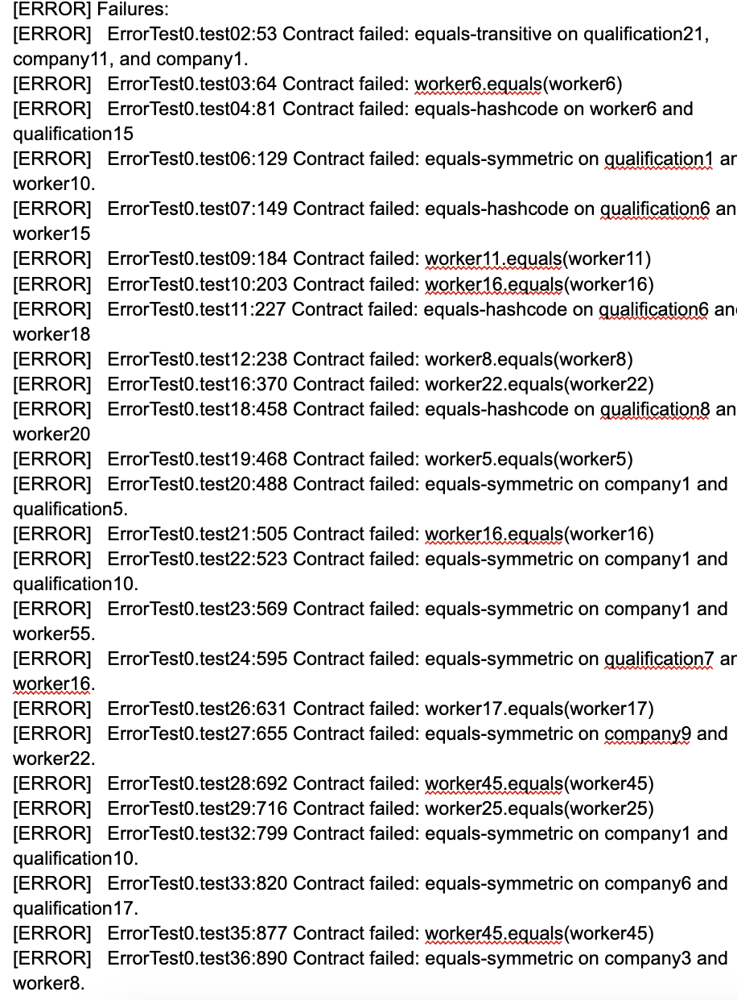
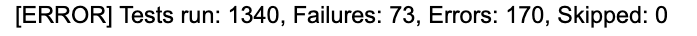
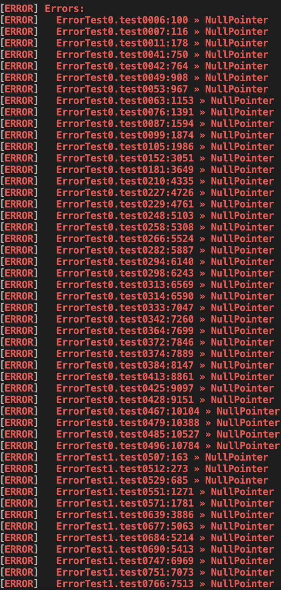
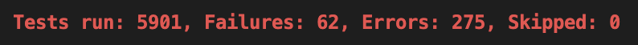

# Randoop / Evosuite
Before changes:

After Changes:

Based on the images above, it is evident that many fixes were made. Even with the regenerated tests (adding 4000 more tests), we still have less errors than we did before. We had a large amount of contract fails beforehand, while as afterwards the errors are drastically reduced to a refactoring of code. Many of the NullPointer errors, we deteremined, are not fixable as they are a result of an exception.
