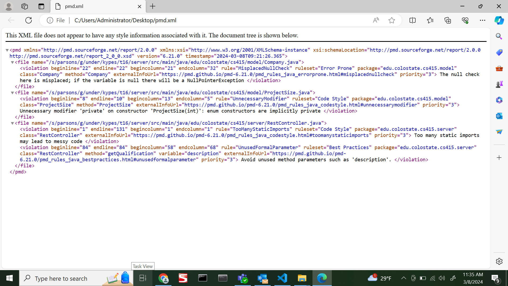
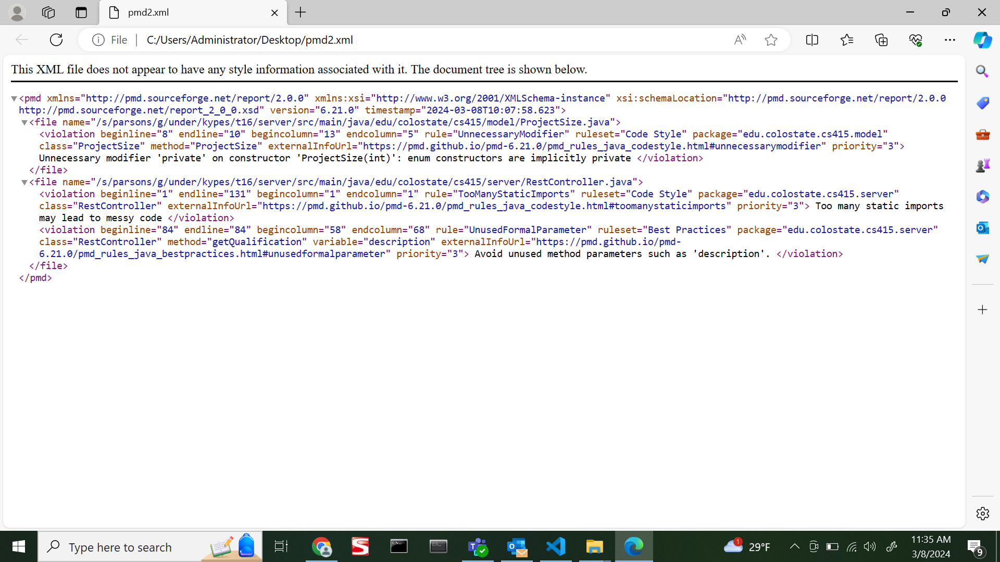
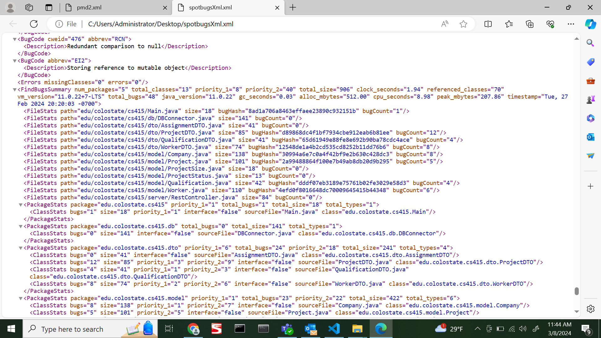
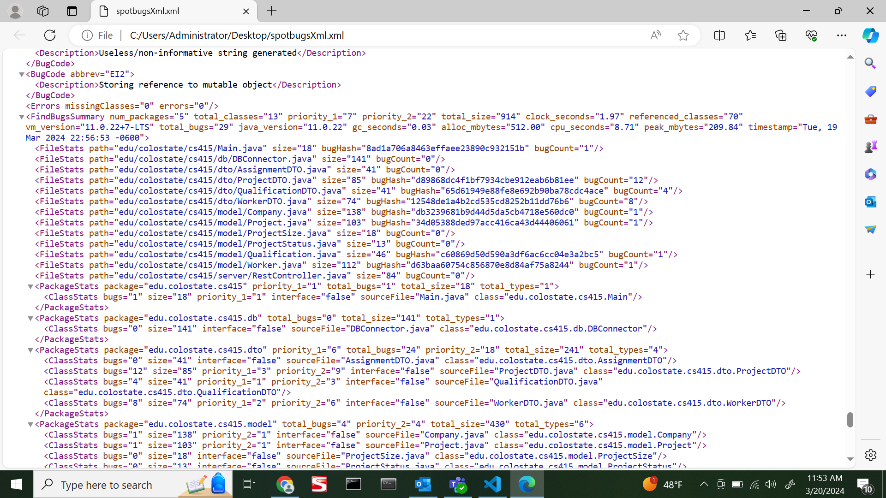

# PMD
Before changes:

After Changes:

# Spotbugs
Before Changes:

After Changes:

As you can see from the above images, there was one issue in the PMD company class that need to be addressed. This issue was fixed and can be seen in the after changes photo. For spotbugs 5 issues for Worker, 3 for Qualifications, 4 for Company, and 7 for Project were all addressed. Each of these classes still have one issue, but after consulting the professor, we have decided that this should not be changed as it is an error with throwing an exception in the constructors for each class. 
